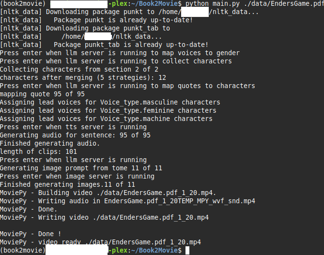
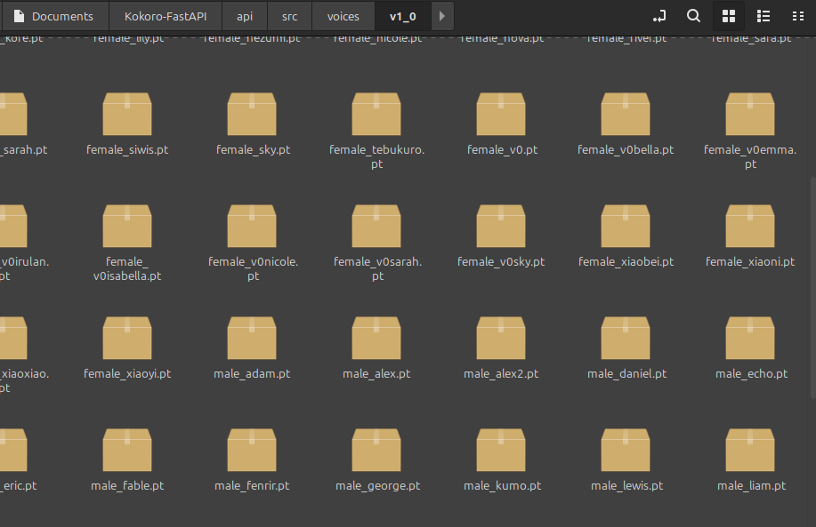

# Book2Movie

A local-first script to process ebooks into slideshows or movies using several types of generative AI.

---
[](https://www.youtube.com/watch?v=ugKktBD26ls)
---

## Requirements

- [conda](https://docs.conda.io/en/latest/)
- [portaudio19-dev](http://www.portaudio.com/)
- [ffmpeg](https://ffmpeg.org/)
- [ComfyUI](https://github.com/Comfy-Org/ComfyUI)
- [Kokoro-FastAPI](https://github.com/remsky/Kokoro-FastAPI)

---

## Installation

```sh
conda create --name book2movie python=3.11
pip install -r requirements.txt
sudo apt install ffmpeg
#modify config to give some hints about the book
python main.py ./data/{bookname.pdf/epub} {page_start} {page_end}
```

---

## Usage

### Basic Processing

```sh
python main.py data/AStudyInScarlet.epub 4 17
```

### ComfyUI Setup

```sh
python main.py --listen 0.0.0.0 --port 8188
```

Models in required folders for the given comfyui workflow:
Comfyui/models/diffusion_models/{Config.IMAGE_MODEL} #Should be a z-image-turbo based model
Comfyui/models/text_encoders/qwen_3_4b.safetensors
Comfyui/models/vae/ae.safetensors

Image prompt in the config is up to personal preference. 
---

## Kokoro-FastAPI Voice Mapping


- For best results, prepend all models in Kokoro-FastAPI with `male`, `female`, and at least one `machine`.
- Leave `af_heart.pt` as is (it's hardcoded).
- This improves voice mapping so male characters are more likely to use male voices, etc. Current voice types are "Masculine", "Feminine", "Machine", and "Unknown".

---

## Ollama (for 24GB VRAM users)

```sh
ollama pull gemma3:27b-it-qat
ollama pull mistral-small3.2:24b
```

- **Gemma3**: Best for structured outputting a list of characters.
- **Mistral-small3.2**: Slightly better for mapping characters to quotes.
- Model names are in the config.

## FAQ

```sh
Failed to parse Speaker from completion 
```
This means the model wasn't smart enough to return an object that could be correctly parsed. Gemma3 is about the dumbest model I think that can be used here and even then, its rare, but it happens. Just run the script again.

```sh
Couldn't find ffmpeg or avconv - defaulting to ffmpeg, but may not work
```
ffmpeg is required by both pydub and this script itself. Make sure ffmpeg is available in your PATH
---

# How it works

## Preprocessing:

Gathers data from pdf or text the best it can. Uses NLTK to break text into sentences. Honestly probably useless since I had to make a big block to catch and attempt to fix many, many cases that NLTK didn't parse correctly. Sentences are grouped as they are read into "paragraphs" by narration (outside of quotation marks) and quotes (inside of quotation marks).

## Voices:

TTS API is hit to get a list of voice names. These names are passed to an LLM to try and map them to a type (or gender). Types include Masculine, Femenine, Machine, or Other. This is used later to give voices to characters based on their type. Alltalk TTS was cool for this since all the voices start with male_ or female_. Others sometimes use m_ or f_ which isn't quite enough for small, dumb, local models to reliabely classify.

## Characters:

The text is then broken into large sections so characacters can be collected as an array in a constructed output. Shoutout to Gemma3 for being able to handle this locally. Most models that fit on an RTX 3090 cause parse errors. I've only seen 1 from Gemma3 on this step. Anyway, this list is deduped programmatically the best we can through a "strategy" array. An llm call exists to dedupe as well, but it was too annoying to try and rectify the sections and aliases afterwards so it is disabled.

## Quote Mapping:

The longest part of a generation. All text outside of quotes is assigned to the "narrator" character. All groups of text inside quotes is sent through a two-pass system to try and sus out which character said the quote. First pass uses a passage of surrounding text (size can be set in the config for tinkerers) and the quote itself. The llm is tasked with creating an analysis to come up with who is most likely to have delivered each line. The second pass uses that analysis and a list of characters that were found in the surrounding section. IE the book opens with Watson and Stamford, ideally Sherlock Holmes wouldn't even be an option for the first few quotes. Unless the title of the first chapter was "Sherlock Holmes" of course. :)

Anyway, this was also the longest to write. Apperently LLMs are pretty bad at classification. Who would've thought? The whole two-pass system with characters was a result of about 2 weeks of tinkering between different models, prompts, formats, and context size (how much surrounding text, not llm context size). The most eye opening part of the project is how little of a difference there is between a relatively dumb model like Mistral-small3.2(30B) and the big boy models like GPT-oss-120B, QWEN3-235B, and Deepseek R1 0528. Small models get like 90% accuracy. Big models get like 92%. There is hardly any rhyme or reason for some of the missed quotes. For example: 

```sh
“Poor devil!” he said, commiseratingly, after he had listened to my misfortunes. “What are you up to now?”
```

The “What are you up to now?” mapping seems like a crapshoot where the llm misses ~25% of the time, regardless of model. Maybe someday I'll create and publish a benchmark so they actually improve.

## Characters to Voices Mapping:

Nothing AI related here, but we do use an algorithm to minimize the overlap between voices in a dialog. After taking out the narrator's voice, we allocate ~33% of the voices for each type and use them for our "leads", ie characters who talk the most. Those characters get their own voice that will not be shared. The other 67% of the available voices are then shared for all the other characters in an iteration loop, ideally seperating out the voices heard as far away as possible. The voice name is then attached to every quote before we run them all through our TTS api.

## Audio/TTS

At this point we have everything we need to rip through an entire book's worth of audio content. Neat. In development, I experimented with xttsv2 and kokoro. Kokoro is blazing fast and sounds better with one rough exception; exceedingly short generations like 'he said' and 'she said' sound horribly robotic. Might be a user issue if kokoro fastAPI is using espeak-ng for these two-word generations. Anyway, after all the audio is generated, we split it into our "Tomes". In this case, a "Tome" is N seconds of text and audio (set in the config) that we use to build our images.

## Image Prompts

Again, we lean on our LLM to describe the most important visual bits inside the tome. We use our config for some extra guidance here like including some details about the theme, setting, plot, tone, etc. To get a better image prompt, surrounding tomes are also appended as part of the prompt context. Image pre-prompt and negative prompt are also set in the config.

## Image Gen

Z-Image-Turbo was a giant leap over SDXL or SDXL Turbo for generations from an LLM generated prompt. I had to rewrite the service and learn the wild comfyUI API to use it, but so, so worth it. I'm going to assume qwen3_4b is doing a *lot* of heavy lifting in the comfyUI workflow. Anyway, any image model will do with the right workflow.

## Making the Movie

The audio and images are saved as blobs in a json file. I know. Probably a huge mistake on my part but where I come from, saving files as anything besides a blob feels like a horrible sin that I don't think I can get my keyboard to commit. Oh well. Shout out to ffmpeg and pydub for making what could have been the hardest part of this script into the easiest. 

# Final Thoughts

I'll move this to my blog eventually but here we go. The goal of this project were two-fold. A.) Netflix-style 2nd monitor content so I could "read" some sci-fi books while playing OSRS. Specifically "Ender's Game" and later "Dune", *btw*. Those were the actual books I used in development, not Sherlock Holmes until I started to wrap it up. Z-image-turbo can do an absolutely menacing rendition of Baron Harkonen. B.) Any improvement over short-form content or high-energy garbage for my daughter to watch. "The Secret Garden" works pretty darn well, besides a few characters thick accent written as "th'" instead of "the" and things like that. TTS doesn't stand a chance. There are many improvements that could be made;

- adding and generating a character description during the character phase and adding it to the image prompt-prompt based on character.section to improve character images
-  fastAPI and UI so user could modify character details, assign voices, fix mapping, etc.
- Actual DB use. TinyDB was a massive upgrade over throwing everything into a pickle when I started but saving WAVs is asking a bit much.
- Fix/rework generating books one part at a time. Maybe. The algorithms are somewhat built to retain and append to characters when the book is generated in multiple sections. This was broken when I started saving progress mid-step. After a lot of mulling it over and discussion with another developer friend, I realized that every effort to make the output better resulted in some version of reading through the whole book before we start. If you want to test the script, generate a chapter. If you actually want to watch a book, just generate the whole thing. You can stop and resume the script just fine.
- short tts generations. This wasn't a problem with xttsv2 but kokoro fastapi. I've considered regexing a few two-word phrases and joining that to same-speaker quotes around them so it is all generated together with the voice of the character, but the juice doesn't seem worth the squeeze right now

Important lessons I got include better version control. I started and finished a much, much simpler version of this as early as Aug 2024. I then took a year off when my daughter was born and realized the project folder I thought this was in had a completely different project inside. It ended up being for the best to start over since I knew what I was doing when I started the 2nd time and fixed a lot of issues. The original version I wrote was more-or-less passing all the text to tts and passing raw passages to A1111 sd-webui. The ffmpeg command also had a wierd pause glitch that I was never going to be able to solve. Copilot (pointed to ollama qwen3-coder atm) was used for a few small functions here and there and are pretty obvious if one cares to look for them imo. I tried opencode (GLM 4.6 I think) one time after backing up the project when I was upgrading from pickles everywhere to TinyDB. Hoooooleeeeeey shiiiiiiiiiit did it try and fuck things up. I've since used it again to generate a blog site and it did great. Admittedly, the whole thing was a single react page and trying to move components and type definitions to their own files has the same effect as deleting them so... ¯\\\_(ツ)\_/¯

Anyways, I finally got my homelab's intel arc A770 to run ollama and comfyui so I'm ready to move on. 
